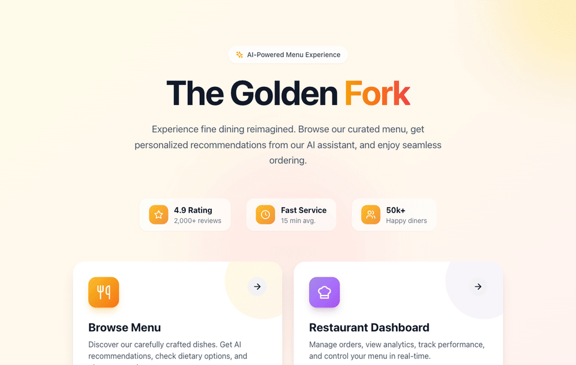

# The Golden Fork

> A full-stack AI restaurant operations platform connecting customers, kitchen, and managers in real time.

## What it does

The Golden Fork is a full-stack AI restaurant operations platform for restaurants that want one connected system across three surfaces. Customers get smart, dietary-aware menu recommendations and order online; the kitchen sees orders stream in live on a Kanban board (New → In Progress → Ready); and managers watch sales velocity and menu performance update in real time.

## How it works

A customer chats or browses → a RAG pipeline finds the best-matching, dietary-aware dishes → they order and pay via Stripe → the order streams in real time to the kitchen display → managers watch sales velocity and menu performance live.

## Architecture / Built production-grade

- **RAG semantic menu search** using Pinecone + OpenAI `text-embedding-3-small` (1536-dim) embeddings, tunable via `TOP_K_RESULTS` and `SIMILARITY_THRESHOLD`.
- **AI recommendation engine** with structured LLM output (`suggestedItems`), conversation history, dietary filters, and per-request `processingTimeMs` latency observability.
- **Real-time WebSocket order tracking** synchronized across all three surfaces (customer, kitchen, manager).
- **Stripe webhook-driven checkout** as a fault-tolerant transaction boundary — order mutations commit only after signed-webhook verification.
- **Hardened API surface** with 10+ REST routes, rate-limited endpoints, and `/health` endpoints for monitoring.
- **Regression coverage** via Playwright E2E tests plus a JSON-driven chatbot-test-runner suite.

## Tech stack

Next.js 16 · TypeScript · Node.js · OpenAI · Pinecone · RAG · Stripe · WebSocket

## Live demo

- Live app: https://golden-fork-9tn2.onrender.com (Render free tier — may cold-start for ~15s)
- Source: https://github.com/aidenmak0624/golden-fork

> Note: maintainer should add `demo.gif` (source `goldenfork_demo.gif` / `.mp4`) to the repository root so the embedded demo renders.
